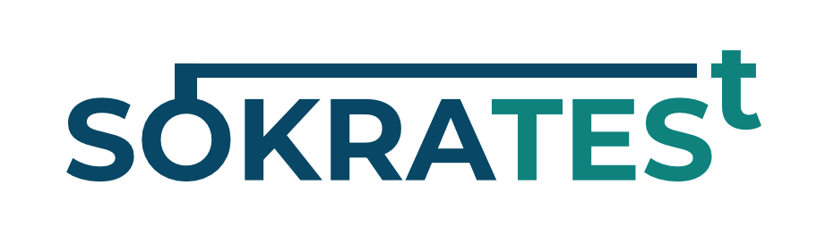
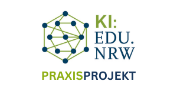
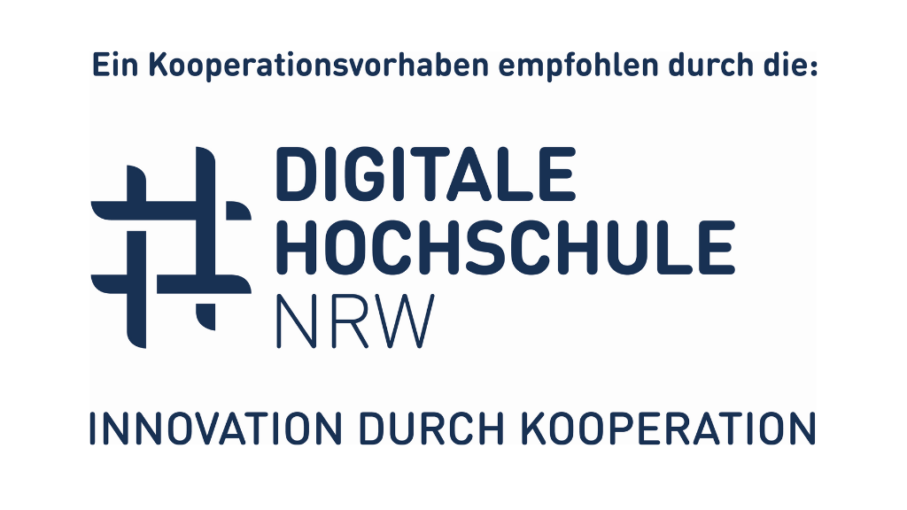

<p align="center">
  
</p>

<p align="center">
  <strong>AI-powered learning platform with RAG capabilities and course management</strong>
</p>

<p align="center">
  <a href="#features">Features</a> •
  <a href="#technology-stack">Tech Stack</a> •
  <a href="#installation--deployment">Installation</a> •
  <a href="#development">Development</a> •
  <a href="#using-the-application">Usage</a> •
  <a href="#funding">Funding</a>
</p>

---

## Overview

Sokrates<sup>t</sup> is a Next.js-based learning platform with AI-powered document processing, RAG (Retrieval-Augmented Generation) capabilities, and course management features. The platform enables intelligent interaction with educational materials through semantic search and AI assistance.

## Features

| Feature | Description |
|---------|-------------|
| **AI-Powered Chat** | Interactive chat interface with AI models for educational support |
| **Document Processing** | Automated conversion and vectorization of educational materials |
| **Semantic Search** | RAG-based document retrieval using vector embeddings |
| **Multi-User Support** | Role-based access control with organizations and courses |
| **Rich Text Editing** | Advanced editor with Plate UI for document creation |
| **Course Management** | Comprehensive course and user management system |
| **Analytics** | Optional integration with Umami for usage analytics |
| **Observability** | Optional Langfuse integration for AI tracing and monitoring |

## Technology Stack

| Category | Technology |
|----------|------------|
| **Frontend** | Next.js, React, TailwindCSS |
| **Authentication** | Better Auth |
| **Database** | PostgreSQL (with pgvector) |
| **Vector Database** | Qdrant |
| **Object Storage** | MinIO (or any S3-compatible) |
| **Background Jobs** | Trigger.dev |
| **Document Processing** | Docling API |
| **AI Models** | OpenAI-compatible API (configured for GWDG SAIA) |

## AI Model Configuration

> **Important**: This project is currently configured to use AI models hosted by the GWDG (Gesellschaft für wissenschaftliche Datenverarbeitung mbH Göttingen) via their [SAIA (Scalable AI Applications)](https://docs.hpc.gwdg.de/services/saia/index.html) service.

If you want to use different AI models or providers (e.g., OpenAI, Anthropic, or other OpenAI-compatible endpoints), you need to:

1. Update the model configurations in `src/lib/ai/saia-models.ts`
2. Adjust the `OPENAI_COMPATIBLE_BASE_URL` and `OPENAI_COMPATIBLE_API_KEY` in your `.env` file

---

## Prerequisites

Before deploying Sokrates<sup>t</sup>, you need to set up the following external services:

### Required External Services

1. **Trigger.dev** - Background task processing for document handling and vectorization
   - Self-hosted: [Trigger.dev Installation Guide](https://trigger.dev/blog/self-hosting-trigger-dev-v4-docker) (If you are using [Coolify](https://coolify.io/), use [this template](https://github.com/essamamdani/coolify-trigger-v4)).
   - Or use [trigger.dev Cloud](https://trigger.dev)
   - Used for long-running tasks like document processing and embedding generation

2. **Qdrant** - Vector database for semantic search and RAG
   - Self-hosted: [Qdrant Installation Guide](https://qdrant.tech/documentation/guides/installation/)
   - Or use [Qdrant Cloud](https://cloud.qdrant.io/)
   - Required for storing and querying document embeddings

3. **Docling API** - Document conversion service (PDF to Markdown)
   - Converts uploaded documents into structured Markdown format
   - Required for the document processing pipeline
   - **Note**: When using GWDG SAIA, the Docling API is accessed via the same OpenAI-compatible endpoint as inference. No separate configuration is needed. If using a different backend, you may need to host your own Docling instance.

4. **OpenAI-Compatible AI API** - For language models and embeddings
   - Default: [GWDG SAIA](https://docs.hpc.gwdg.de/services/saia/index.html)
   - Or any OpenAI-compatible endpoint

### Optional External Services

5. **Langfuse** (Optional) - AI observability and tracing
   - Self-hosted: [Langfuse Self-Hosting Guide](https://langfuse.com/docs/deployment/self-host)
   - Or use [Langfuse Cloud](https://cloud.langfuse.com/)

6. **Umami** (Optional) - Privacy-focused web analytics
   - Self-hosted: [Umami Installation Guide](https://umami.is/docs/install)
   - Or use [Umami Cloud](https://cloud.umami.is/)

7. **SMTP Server** (Optional) - Email delivery (if email features are needed)
   - **Note**: Email functionality is not fully configured yet

### Included in Docker Compose

The following services are included in the `docker-compose.yml` and **do not** require external setup:

- **PostgreSQL** (with pgvector extension)
- **MinIO** (S3-compatible object storage)

---

## Installation & Deployment

### 1. Clone the Repository

```bash
git clone https://github.com/SokratesT/sokratest-next.git
cd sokratest-next
```

### 2. Configure Environment Variables

Copy the example environment file and configure it with your credentials:

```bash
cp example.env .env
```

Edit the `.env` file with your configuration. Here are the key variables you need to set:

#### Authentication & Base URLs
```env
BETTER_AUTH_SECRET=your_secure_random_secret
BETTER_AUTH_URL=https://your-domain.com
NEXT_PUBLIC_BASE_URL=https://your-domain.com
```

#### Database (Defaults from docker-compose)
```env
POSTGRES_USER=postgres
POSTGRES_PASSWORD=postgres
POSTGRES_DB=sokratest-next
POSTGRES_HOST=postgres
POSTGRES_PORT=5432
```

#### Storage (Defaults from docker-compose)
```env
S3_ENDPOINT=minio
S3_PORT=9000
S3_ACCESS_KEY=minioadmin
S3_SECRET_KEY=minioadmin
S3_USE_SSL=false
```

#### Required External Services
```env
# Trigger.dev
TRIGGER_SECRET_KEY=your_trigger_secret
TRIGGER_API_URL=https://api.trigger.dev
TRIGGER_PROJECT=your_trigger_project_id

# Qdrant Vector Database
QDRANT_URL=https://your-qdrant-instance.com
QDRANT_API_KEY=your_qdrant_api_key

# AI Models (SAIA/OpenAI-compatible)
# Note: Docling API is accessed via this same endpoint when using SAIA
OPENAI_COMPATIBLE_BASE_URL=https://chat.gwdg.de/v1
OPENAI_COMPATIBLE_API_KEY=your_saia_api_key

# Internal API key for Trigger.dev to update document processing status
SOKRATEST_API_KEY=your_secure_random_key
```

#### Optional Services
```env
# Langfuse (Optional - for AI tracing)
LANGFUSE_SECRET_KEY=your_langfuse_secret
LANGFUSE_PUBLIC_KEY=your_langfuse_public
LANGFUSE_BASEURL=https://your-langfuse-instance.com

# Umami Analytics (Optional)
NEXT_PUBLIC_UMAMI_SCRIPT_URL=https://umami.your-domain.com/script.js
NEXT_PUBLIC_UMAMI_WEBSITE_ID=your_website_id
```

#### SMTP (Not yet used)
```env
SMTP_HOST=localhost
SMTP_PORT=25
SMTP_USERNAME=user
SMTP_PASSWORD=password
```

### 3. Deploy with Docker Compose

The easiest way to deploy Sokrates<sup>t</sup> is using Docker Compose, which includes PostgreSQL and MinIO:

```bash
docker-compose up -d
```

This will:
1. Build the Next.js application
2. Start PostgreSQL
3. Start MinIO for object storage
4. Run database migrations automatically
5. Launch the application on port 3000

#### Access the Services

- **Application**: http://localhost:3000
- **MinIO Console**: http://localhost:9001
- **PostgreSQL**: localhost:5432

### 4. Configure Trigger.dev Tasks

After deployment, you need to deploy your Trigger.dev tasks:

```bash
bun run trigger:deploy
```

This deploys the background task handlers:
- `process-document-task.ts` - Document processing pipeline
- `vectorize-files-task.ts` - Embedding generation and storage

---

## Development

For local development without Docker:

### Prerequisites
- [Bun](https://bun.sh/) (latest version)
- PostgreSQL 16+ with pgvector extension
- Access to external services (Qdrant, Trigger.dev, etc.)

### Setup

1. Install dependencies:
```bash
bun install
```

2. Set up your local database and run migrations:
```bash
bun run db:migrate
```

3. Start the development server:
```bash
bun run dev
```

### Available Scripts

- `bun run dev` - Start development server with Turbo
- `bun run build` - Build for production
- `bun run start` - Start production server
- `bun run lint` - Run linting
- `bun run format` - Format code with Biome
- `bun run db:generate` - Generate database migrations
- `bun run db:migrate` - Run database migrations
- `bun run db:studio` - Open Drizzle Studio
- `bun run trigger:dev` - Start Trigger.dev development server

---

## Project Structure

```
sokratest-next/
├── src/
│   ├── app/              # Next.js App Router pages
│   │   ├── (auth)/       # Authentication routes
│   │   ├── app/          # Main application routes
│   │   └── api/          # API routes
│   ├── components/       # React components
│   ├── db/               # Database schema and queries
│   │   ├── schema/       # Drizzle ORM schemas
│   │   ├── queries/      # Database queries
│   │   └── actions/      # Server actions
│   ├── lib/              # Utility libraries
│   │   ├── ai/           # AI model configurations
│   │   └── tools/        # AI tools and utilities
│   ├── qdrant/           # Vector database operations
│   ├── trigger/          # Background job definitions
│   └── settings/         # Application configuration
├── migrations/           # Database migrations
├── docker/               # Docker configuration files
└── public/               # Static assets
```

## Key Files

- **`src/lib/ai/saia-models.ts`** - AI model configuration (MUST be updated if not using SAIA)
- **`docker-compose.yml`** - Docker orchestration configuration
- **`trigger.config.ts`** - Trigger.dev project configuration
- **`drizzle.config.ts`** - Database ORM configuration

## Database Management

The project uses Drizzle ORM for database management:

- **Migrations**: Located in `migrations/` directory
- **Schema**: Defined in `src/db/schema/`
- **Auto-migration**: Runs automatically in Docker Compose via the `migrations` service

### Manual Migration Commands

```bash
# Generate new migration
bun run db:generate

# Run migrations
bun run db:migrate

# Open drizzle studio
bun run db:studio
```

---

## Using the Application

After successfully deploying Sokrates<sup>t</sup>, follow these steps to set up and use the platform:

### Initial Setup: Create Admin Account

**Critical First Step**: Immediately after deployment, navigate to `/init` to create the main administrator account:

```
https://your-domain.com/init
```

**Important**: The `/init` route is publicly accessible until the first account is created. Once an admin account exists, this route becomes unavailable for security reasons. Make sure to complete this step immediately after deployment.

### Understanding User Roles

Sokrates<sup>t</sup> has two levels of roles:

#### Organization Roles

- **Owner**: The user who created the organization. Has full administrative privileges.
- **Admin**: Full administrative access to the organization, including user and course management. Functionally equivalent to owners.
- **Member**: Basic organization membership with view-only access. Members can only see the organization but cannot manage users or courses.

#### Course Roles

- **Instructor**: Full access to course management, including:
  - Uploading and managing course resources/documents
  - Configuring AI models and system prompts
  - Accessing the AI chat interface
  - Creating course invitations
  
- **Student**: Limited access focused on learning, including:
  - Accessing the AI chat interface
  - Viewing course materials
  - Cannot upload or manage resources

### Setting Up Your Organization

1. **Create an Organization** (as admin)
   - Navigate to `/app/orgs`
   - Click "Add Organization" to create your first organization
   - Provide a name and description for your organization

2. **Create Courses**
   - Navigate to `/app/courses` or access courses through your organization view
   - Click "Add Course" to create a new course
   - Provide course details (title, description)
   - Configure AI settings:
     - Select an AI model from the available SAIA models
     - Customize the system prompt (defaults to a Socratic tutor approach)
   - These settings can be modified later by editing the course

### Managing Course Resources

Resources are documents (e.g. PDFs, images, etc.) that the AI will use for RAG-based responses.

1. **Upload Documents**
   - Navigate to a course's resources/documents section
   - Upload files
   - Multiple files can be uploaded at once

2. **Process Documents for RAG**
   
   **Critical Step**: After upload completes, documents must be manually processed before the AI can use them.
   
   Two ways to process documents:
   
   - **Single Document**: Click the "Process Document" button on an individual document
   - **Bulk Processing**: 
     - Select multiple documents using checkboxes in the table view
     - Click the "Actions" button at the top
     - Select the bulk process option

   Processing involves:
   - Converting documents to Markdown (via Docling API)
   - Processing markdown into smaller chunks
   - Generating embeddings for each chunk
   - Storing vectors in Qdrant
   - This is handled by Trigger.dev background tasks

3. **Using Processed Documents**
   - Once processing is complete, the AI chat can reference these documents
   - The RAG system will retrieve relevant sections based on user queries for the currently active course
   - Responses will be grounded in the course materials

### Inviting Users to Courses

Since email functionality is not yet fully configured, invitation links must be shared manually.

1. **Create Invitations** (Organization Admins only)
   - Navigate to `/app/users`
   - Click "Create Invitation" or similar action
   - Select the target course
   - Choose the role: **Student** or **Instructor**
   - An invitation link will be generated

2. **Share the Invitation Link**
   - Copy the generated invitation link or download the table as `.csv`
   - Send it directly to the user via your preferred communication method
   - The link allows the user to register and automatically gain access to the specified course

3. **User Registration**
   - Recipients navigate to the invitation link
   - They create their account through the registration process
   - Upon completion, they automatically have access to the course with the assigned role

4. **Users already on the platform**
   - If a user is already registered, you don't need to send them their invitation link
   - Provided you used the same email, they can accept pending invitations via their `/account` panel. 

### Managing Users

Organization admins can manage all users within their organization:

1. **View Users**
   - Navigate to `/app/users`
   - See all organization members and their roles

2. **Adjust Roles**
   - Modify organization roles (Owner, Admin, Member)
   - Modify course roles (Instructor, Student)
   - Add or remove users from courses

3. **Access Control**
   - Only organization Owners and Admins can manage users
   - Owners and Admins can create invitations
   - Members have view-only access to the organization

### Switching courses or organizations
1. **Switch Course**
   - The currently active course is displayed in the top left of the sidebar
   - This determines which users or resources you can currently manage
   - The AI chats are stored per organization -> course
   - The currently active course determines which resources, model, and system prompt will be used in the chat

2. **Switch Organization**
   - To switch to another organization, click on your profile in the bottom left of the sidebar
   - Each organization has a separate set of courses, meaning your choice of courses will change depending on the active organization
   - Typically only one organization should be needed per deployment

### Using the AI Chat Interface

1. **Access Chat**
   - Navigate to `/app/chat`

2. **Interact with AI**
   - The AI uses the model and system prompt configured for the course
   - If documents have been processed, the AI will use RAG to ground responses in course materials
   - The default system prompt follows a Socratic teaching methodology

3. **Chat Features**
   - View chat history
   - Start new conversations
   - AI responses cite relevant course documents when available

### Course Configuration

Instructors and Admins can configure course settings:

1. **Edit Course Settings**
   - Navigate to the course view
   - Click "Edit" to modify course settings
   - Available options:
     - Course title and (short) description
     - AI model selection (from available SAIA models)
     - System prompt customization
     - Default prompt uses Socratic teaching methodology

2. **AI Model Selection**
   - Choose from SAIA models configured in `src/lib/ai/saia-models.ts`
   - Different models may have different capabilities (text, image, multimodal)

3. **System Prompt Customization**
   - Define how the AI should behave and respond
   - Tailor the teaching approach to course objectives
   - Default: Socratic tutor methodology

---

## Troubleshooting

### MinIO Connection Issues
If you have issues connecting to MinIO, ensure:
- The `S3_ENDPOINT` matches your deployment (e.g., `minio:9000` for Docker, `localhost:9000` for local)
- `S3_USE_SSL` is set correctly (`false` for local development)
- Buckets are created (application auto-creates on first run)
- Running locally via docker, you will need to map the same domain internally for the image and your local machine (e.g. simply using `localhost` would point to two different locations)

### Database Connection Issues
- Ensure PostgreSQL is running and healthy
- Check `POSTGRES_HOST` matches your setup (`postgres` for Docker, `localhost` for local)
- Verify the database exists and migrations have run
- Check the `pgvector` extension is installed.

### Trigger.dev Tasks Not Running
- Ensure `TRIGGER_SECRET_KEY` is configured correctly
- Ensure `TRIGGER_PROJECT` is set to your Trigger.dev project ID
- Deploy tasks with `bun run trigger:deploy`
- In development, make sure `bun run trigger:dev` is running
- Check Trigger.dev dashboard for task status

### AI Model Issues
- Verify `OPENAI_COMPATIBLE_BASE_URL` is accessible
- Check API key validity
- Review `src/lib/ai/saia-models.ts` for correct model IDs
- Make sure to use the `completions` endpoint

---

## Security Considerations

> **⚠️ Important Security Notes**

1. **Change default credentials** in production:
   - PostgreSQL password
   - MinIO credentials
   - `BETTER_AUTH_SECRET` and `SOKRATEST_API_KEY` (use strong random strings, e.g. via openssl)

2. **Use HTTPS** in production for all external endpoints

3. **Object Storage**: Configure proper access policies for MinIO buckets. All buckets should be private by default.

---

## Support

For issues and questions:
- [GitHub Issues](https://github.com/SokratesT/sokratest-next/issues)
- [SAIA Documentation](https://docs.hpc.gwdg.de/services/saia/index.html)

---

## Funding

Sokrates<sup>t</sup> is an Applied Project of [KI:edu.nrw](https://ki-edu-nrw.ruhr-uni-bochum.de/) and currently in closed access at [Rhine-Waal University of Applied Sciences](https://www.hochschule-rhein-waal.de/). The project received funding by the Ministry of Culture and Science of the State of North Rhine-Westphalia and has been recommended as a cooperation endeavour by Digitale Hochschule NRW.

<p align="center">
  <a href="https://ki-edu-nrw.ruhr-uni-bochum.de/ueber-das-projekt/phase-2/praxis-transferprojekte/aktuelle-praxisprojekte/#sokratest">
    
  </a>
  &nbsp;&nbsp;&nbsp;&nbsp;
  <a href="https://www.dh.nrw/">
    
  </a>
  &nbsp;&nbsp;&nbsp;&nbsp;
  <a href="https://www.mkw.nrw/">
    
  </a>
</p>
